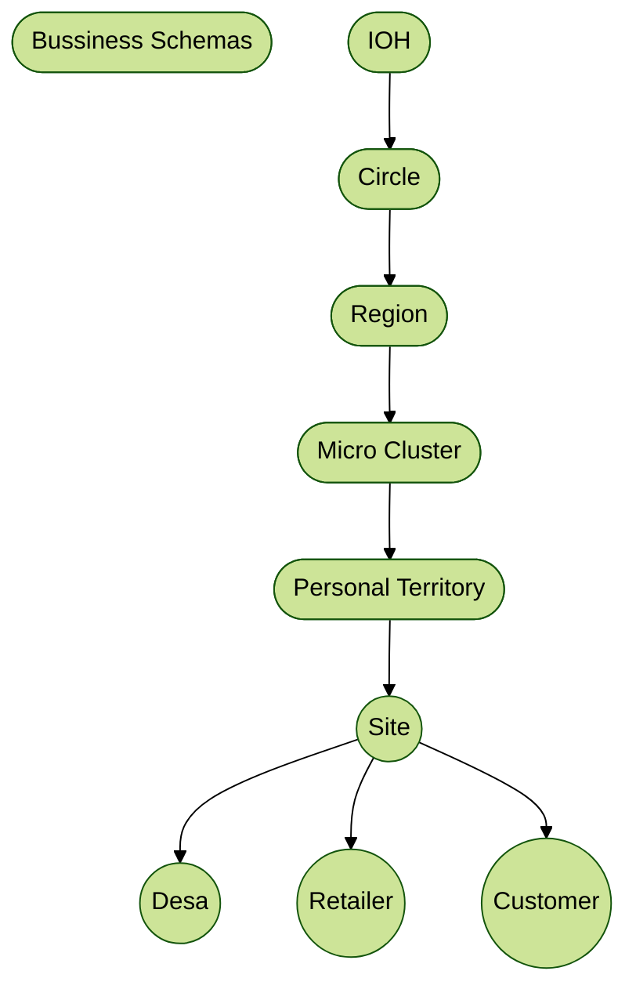

# MIM3 Dashboard

## Indosat Ooredoo Hutchison

adalah sebuah perusahaan telekomunikasi yang menyediakan layanan seluler, internet, dan berbagai solusi digital di Indonesia.

## MIM3 (Mitra IM3)

adalah channel Distribusi dari Indosat ooredoo hutchison yang menyediakan layanan penjualan produk dan layanan Indosat Ooredoo Hutchison.

## Hierarchy Diagram

---

---

## Bussines Schemas

Indosat bekerja sama dengan  MIM3 dalam hal penjualan , penetrasi , branding dan layanan pelanggan atau retailer.
MIM3 mengelola PT(personal territory) yang mencakup wilayah bagian dari MC(micro cluster) yg merupakan Bagian Dari Region di bawah pengawasan Circle.
Di Dalam PT ada Site yg merupakan Tower/ BTS milki indosat ooredoo hutchison.
Site Mencover Desa , Retailer dan Customer.

## Dashboard

Aplikasi ini mencoba membuat sebuah monitoring dashboard terpadu untuk memantau perkembangan bisnis MIM3 di Indonesia.

## Sumber Data

- portal mobo
- portal mobii
- manual input
- daily report dari region

## Sistem laporan

Sistem Laporan Pada Dashboard ini terbagi menjadi 2 bagina yaitu :

1. Laporan penjualan Harian : bersumber dari input data manual masing masing MIM3 atas penjualan harian, baik itu virtual produk / fisik produk.

2. Laporan Sales Margin : bersumber dari data portal mobo berdasarkan data transaksi dan komisi yang didapatkan oleh masing masing MIM3.

3. laporan Sell in : Bersumber dari data portal mobii berdasarkan data transaksi yang dilakukan oleh masing masing MIM3.

4. Laporan KPI : bersumber dari data portal mobo , mobii, data Region berdasarkan data KPI yang telah ditetapkan oleh Indosat Ooredoo Hutchison kepada masing masing MIM3.

5. dashboard dan laporan lain nya yang akan dikembangkan sesuai kebutuhan.

## Cara Install

Untuk menginstall aplikasi ini, silahkan ikuti langkah berikut:

1. pastikan anda sudah menginstall [astral uv](https://docs.astral.sh/uv/getting-started/installation/)
2. installasi python
3. download zip ini (mim3-dashboard.zip)
4. ekstrak zip ini
5. klik `start.bat` untuk menjalankan aplikasi

Jika butuh panduan untuk installasi dan penggunaan, silakan hubungi:

**PT. Dewi Pratama Putri Internusa**
Contact Person: Hasan Ahmad
Email: [hasanmaki.ahmad@gmail.com](mailto:hasanmaki.ahmad@gmail.com)
WhatsApp: [+62 857-7707-6575](https://wa.me/6285777076575)
